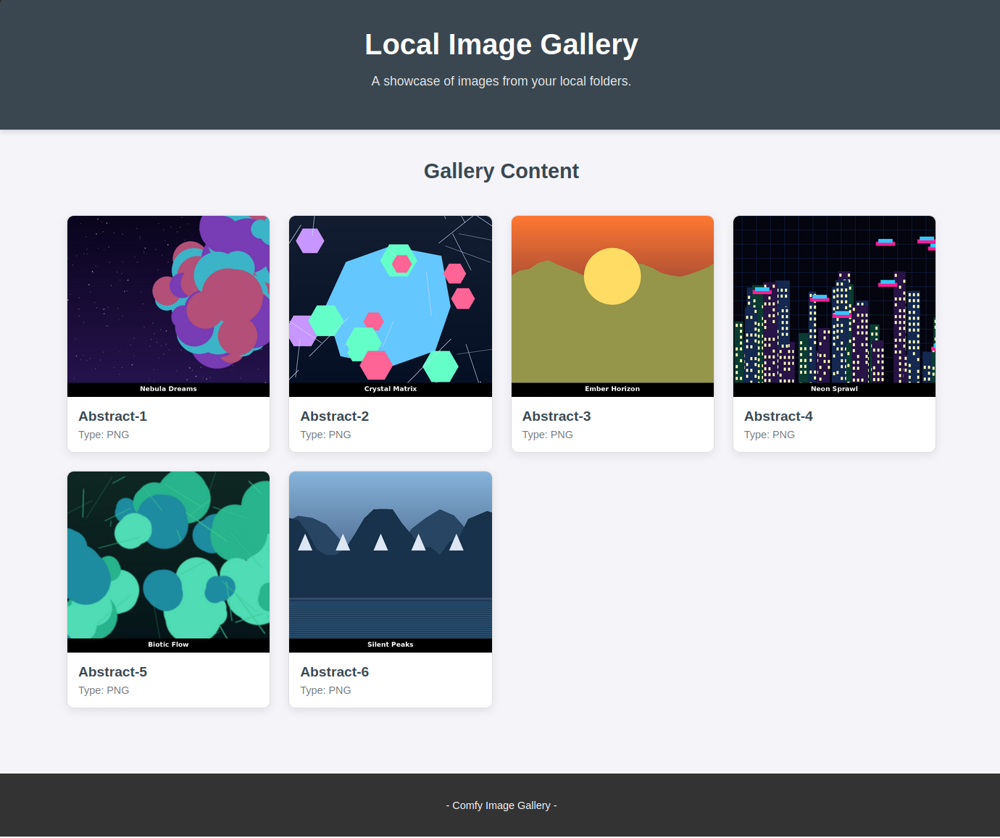

# yet-another-comfy-gallery



A lightweight, beautiful local image gallery built specifically for ComfyUI users.

Browse, zoom, and showcase your AI-generated images with zero hassle — no extra ComfyUI nodes, no cloud, no dependencies beyond Python.

## ✨ Features

- Auto-discovers images from `images/` and `comfy_images/` folders
- Responsive masonry-style grid with lazy loading
- Full-featured lightbox with:
  - Mouse wheel + pinch-to-zoom
  - Drag to pan
  - Slideshow mode (with fullscreen)
  - Keyboard navigation (arrows + Esc)
  - Touch gestures
- Includes a Python script that generates 6 stunning abstract test images
- Simple built-in Python server — just run and open in browser

## 🚀 Quick Start

```bash
# 1. Clone the repo
git clone https://github.com/Randy420Marsh/yet-another-comfy-gallery.git
cd yet-another-comfy-gallery

# 2. (Optional) Generate beautiful sample images
python generate_images.py

# 3. Add your ComfyUI images
#    → Drop them into `comfy_images/` (or `images/`)

# 4. Start the gallery
python run-server.py
Then open http://localhost:5500 in your browser.
Requirements

Python 3
Pillow (only needed for the generator): pip install Pillow

Why "Yet Another"?
Because sometimes you just want something dead simple that works instantly with your local ComfyUI outputs.
License
MIT
